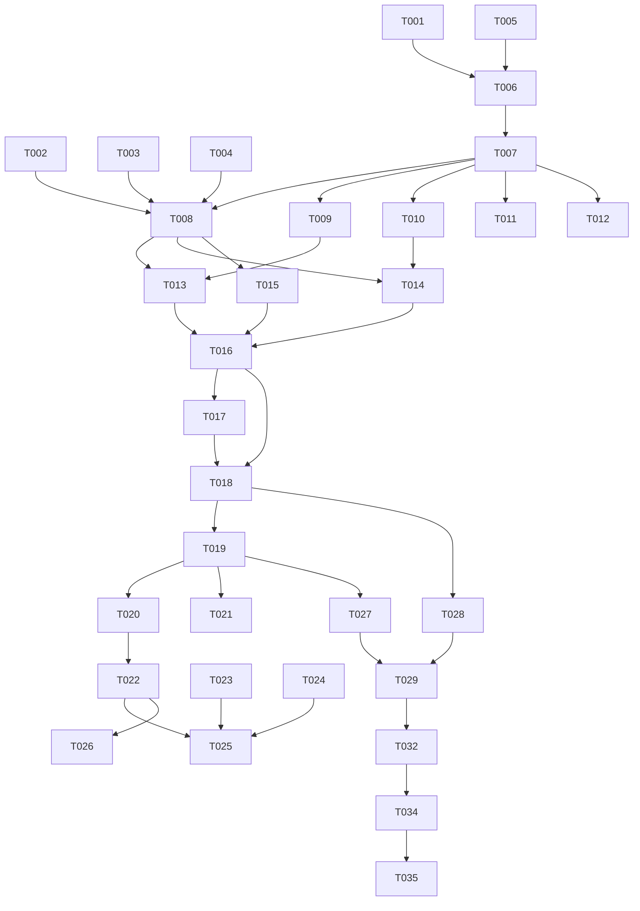

# Tasks: RentNote 代码结构全面优化

**Input**: Design documents from `spec/optimize-code-structure/`
**Prerequisites**: plan.md (required), spec.md (required for user stories)

**Tests**: 未显式请求测试，不包含测试任务

**Organization**: Tasks are grouped by user story to enable independent implementation and testing of each story.

## Format: `[ID] [P?] [Story] Description`

- **[P]**: Can run in parallel (different files, no dependencies)
- **[Story]**: Which user story this task belongs to (e.g., US1, US2, US3)
- Include exact file paths in descriptions

## Phase 1: Setup (Shared Infrastructure)

**Purpose**: 项目目录结构重组和配置文件更新

- [X] T001 创建新目录结构：entry/src/main/ets/repository/、entry/src/main/ets/viewmodel/ 用于存放数据层和视图模型层
- [X] T002 [P] 创建 Navigation 路由表配置文件 entry/src/main/resources/base/profile/route_map.json，注册 AddProperty/PropertyDetail/Settings/About 四个路由
- [X] T003 [P] 更新 entry/src/main/module.json5，添加 routerMap 配置项引用 route_map，将 installationFree 改为 true（元服务应免安装）
- [X] T004 更新 entry/src/main/resources/base/profile/main_pages.json，仅保留 pages/Index 一个页面入口
- [X] T005 [P] 创建 entry/src/main/ets/model/TagModel.ets，将 TagCategory 类从 AddPropertyPage.ets 移入此文件，使用 @ObservedV2+@Trace 装饰器

---

## Phase 2: Foundational (Blocking Prerequisites)

**Purpose**: MVVM 核心基础设施，所有用户故事依赖此阶段完成

**⚠️ CRITICAL**: 此阶段完成前不可开始任何用户故事

- [X] T006 重构 entry/src/main/ets/model/PropertyModel.ets，将所有数据模型类（PropertyInfo、StatisticsOverview、MonthlyRentItem）迁移为 @ObservedV2+@Trace 装饰器体系，移除 TabItem 和 MenuItem 类（改用内联定义或直接使用系统组件）
- [X] T007 创建 entry/src/main/ets/repository/PropertyRepository.ets，实现内存 Mock 仓库：包含预置示例数据、CRUD 方法（getAllProperties/getPropertyById/addProperty/updateProperty/deleteProperty）、统计计算方法（getStatisticsOverview/getMonthlyRentItems/getExpiringProperties），使用 @ObservedV2 装饰器确保数据可观察
- [X] T008 重构 entry/src/main/ets/pages/Index.ets 为 Navigation+Tabs 容器入口页：使用 @ComponentV2+@Local 装饰器，创建 NavPathStack 并通过 @Provide 共享给子组件，使用 Tabs 组件内嵌三个 TabContent（首页/统计/我的），底部 tabBar 使用 @Builder TabBuilder 配合 SymbolGlyph 系统图标，隐藏 Navigation 默认导航栏，通过 AppStorageV2 全局共享 Repository 实例
- [X] T009 创建 entry/src/main/ets/viewmodel/HomeViewModel.ets，封装首页业务逻辑：从 Repository 获取房源列表、计算到期提醒数和月度总支出、提供 loadData/refreshData 方法，使用 @ObservedV2+@Trace 装饰器
- [X] T010 [P] 创建 entry/src/main/ets/viewmodel/StatisticsViewModel.ets，封装统计页业务逻辑：从 Repository 计算统计概览和月度租金数据、获取即将到期房源列表，使用 @ObservedV2+@Trace 装饰器
- [X] T011 [P] 创建 entry/src/main/ets/viewmodel/AddPropertyViewModel.ets，封装新增/编辑房源业务逻辑：区分新增/编辑模式（通过 propertyId）、保存房源到 Repository、表单验证逻辑，使用 @ObservedV2+@Trace 装饰器
- [X] T012 [P] 创建 entry/src/main/ets/viewmodel/PropertyDetailViewModel.ets，封装房源详情业务逻辑：根据 ID 加载房源、删除房源确认，使用 @ObservedV2+@Trace 装饰器

**Checkpoint**: MVVM 基础设施就绪 — Repository、ViewModel、Navigation 容器全部可用

---

## Phase 3: User Story 1 - Tab 切换保持状态 (Priority: P1) 🎯 MVP

**Goal**: 用户在 Tab 间切换时，页面状态完整保留，不会重新加载或重置

**Independent Test**: 首页滚动列表 → 切统计 Tab → 切回首页 → 列表位置和内容保留

### Implementation for User Story 1

- [X] T013 [US1] 创建 entry/src/main/ets/pages/HomeContent.ets，从原 Index.ets 抽取首页内容区逻辑：使用 @ComponentV2+@Local 装饰器，接收 @Param navPathStack 用于子页面跳转，通过 ViewModel 加载房源列表，展示月度概览卡片、3 个指标卡片（在租数/到期数/月支出）、房源列表（ForEach+PropertyCard），FAB "+"按钮调用 navPathStack.pushPathByName 跳转 AddProperty 页面，空列表时显示空状态占位提示
- [X] T014 [P] [US1] 创建 entry/src/main/ets/pages/StatisticsContent.ets，从原 StatisticsPage.ets 改造为 Tab 内容组件：使用 @ComponentV2+@Param 装饰器，通过 StatisticsViewModel 加载统计概览和月度数据，展示 SummaryCard、BarChart（按比例渲染）、到期提醒卡片，移除 @State currentTab 和 HeaderBar（Tab 内容不需要）
- [X] T015 [P] [US1] 创建 entry/src/main/ets/pages/MyContent.ets，从原 MyPage.ets 改造为 Tab 内容组件：使用 @ComponentV2+@Param 装饰器，接收 navPathStack 用于跳转设置/关于页，用户资料卡片、菜单列表（MenuItemRow 使用 SymbolGlyph 图标），移除 @State currentTab 和独立的 HeaderBar
- [X] T016 [US1] 重构 entry/src/main/ets/pages/Index.ets 的 Tabs 结构，将三个 TabContent 分别引用 HomeContent、StatisticsContent、MyContent 组件，确保 @Provide navPathStack 可被子组件 @Consume 接收

**Checkpoint**: Tab 切换保持状态 — 首页/统计/我的三个 Tab 自由切换，状态完整保留

---

## Phase 4: User Story 2 - 查看房源详情 (Priority: P1)

**Goal**: 点击房源卡片跳转到对应房源详情页，显示该房源的真实数据

**Independent Test**: 点击房源卡片 A → 详情页显示 A 的信息 → 返回 → 点击 B → 详情页显示 B 的信息

### Implementation for User Story 2

- [X] T017 [US2] 重构 entry/src/main/ets/components/PropertyCard.ets，迁移为 @ComponentV2+@Param 装饰器体系，接收 PropertyInfo 参数，点击时通过 @Consume 获取 navPathStack 并调用 pushPathByName('PropertyDetail', { propertyId: property.id })
- [X] T018 [US2] 重构 entry/src/main/ets/pages/PropertyDetailPage.ets 为 NavDestination 页面：使用 @ComponentV2 装饰器，通过 NavDestination 的 onReady 回调获取传入的 propertyId 参数，从 PropertyDetailViewModel 加载对应房源数据，展示房源头部（名称/地址/标签）、地图卡片、租约信息网格、账单卡片、编辑/删除操作按钮，统一使用 HeaderBar 组件，通过 pop 返回首页

**Checkpoint**: 房源详情页按 ID 展示对应数据，返回后首页状态保留

---

## Phase 5: User Story 3 - 新增房源 (Priority: P1)

**Goal**: 填写房源表单并保存，新房源出现在首页列表和统计数据中

**Independent Test**: 点击"+"→ 填写 → 保存 → 首页出现新房源 → 统计数据更新

### Implementation for User Story 3

- [X] T019 [US3] 重构 entry/src/main/ets/pages/AddPropertyPage.ets 为 NavDestination 页面：使用 @ComponentV2 装饰器，通过 onReady 获取可选的 propertyId 参数区分新增/编辑模式，表单字段保持不变（社区名/地址/租金/日期/标签/备注），标签数据从 TagModel.ets 引入，"保存房源"按钮实现 onClick 调用 AddPropertyViewModel.saveProperty()，保存后调用 navPathStack.pop({ result: { saved: true } })，新增必填字段验证（社区名、月租金），统一使用 HeaderBar 组件，移除原有 @State 改用 @Local/@Param

**Checkpoint**: 新增房源保存功能完整，保存后首页和统计页数据同步更新

---

## Phase 6: User Story 4 - 统计页面数据准确展示 (Priority: P2)

**Goal**: 统计页数据来源于实际房源列表，柱状图按金额比例渲染

**Independent Test**: 有 3 条房源 → 统计页月均=总月租/3 → 柱状图高度按比例

### Implementation for User Story 4

- [X] T020 [US4] 重构 entry/src/main/ets/components/BarChart.ets，实现按数据比例渲染柱高：计算所有 MonthlyRentItem 中的最大金额 maxAmount，每根柱高 = (item.amount / maxAmount) * 图表最大高度，金额为 0 时显示最小高度 4px，迁移为 @ComponentV2+@Param 装饰器体系
- [X] T021 [US4] 重构 entry/src/main/ets/components/SummaryCard.ets，迁移为 @ComponentV2+@Param 装饰器体系，参数类型从 string 改为 number（匹配实际数据类型），显示时格式化为千分位

**Checkpoint**: 统计页数据实时计算，柱状图按比例渲染

---

## Phase 7: User Story 5 - 视觉组件规范化 (Priority: P2)

**Goal**: Emoji 替换为系统图标、统一 HeaderBar、移除假 StatusBar、TagCategory 位置修正

**Independent Test**: 逐页检查无 Emoji、HeaderBar 统一、无假 StatusBar

### Implementation for User Story 5

- [X] T022 [P] [US5] 重构 entry/src/main/ets/components/MenuItemRow.ets，将 Emoji 图标参数改为 SymbolGlyph 系统图标资源名，内部使用 SymbolGlyph 组件渲染，迁移为 @ComponentV2+@Param+@Event 装饰器体系，点击事件通过 @Event 回调触发 navPathStack 操作而非组件内部直接调用 router
- [X] T023 [P] [US5] 重构 entry/src/main/ets/pages/SettingsPage.ets 为 NavDestination 页面：使用 @ComponentV2 装饰器，统一使用 HeaderBar 组件（showBack=true），Emoji 替换为 SymbolGlyph（⚙️→gear、🔔→bell、🔒→lock、📋→doc_text），通过 @Consume 获取 navPathStack 用于返回操作，移除自定义 @Builder SettingItem 改用 MenuItemRow 组件
- [X] T024 [P] [US5] 重构 entry/src/main/ets/pages/AboutPage.ets 为 NavDestination 页面：使用 @ComponentV2 装饰器，统一使用 HeaderBar 组件（showBack=true），通过 @Consume 获取 navPathStack 用于返回操作
- [X] T025 [US5] 删除 entry/src/main/ets/components/StatusBar.ets（装饰性假状态栏），从所有页面引用中移除该组件
- [X] T026 [US5] 删除 entry/src/main/ets/components/TabBar.ets（由 Navigation+Tabs 内置 tabBar 替代），清理所有旧引用

**Checkpoint**: 全部视觉规范化完成 — 0 个 Emoji、统一 HeaderBar、无假 StatusBar

---

## Phase 8: User Story 6 - 房源编辑与删除 (Priority: P3)

**Goal**: 编辑房源预填充数据并保存更新；删除房源带确认弹窗，列表和统计同步更新

**Independent Test**: 详情页编辑 → 修改保存 → 信息更新；详情页删除 → 确认 → 列表移除

### Implementation for User Story 6

- [X] T027 [US6] 实现房源编辑功能：在 PropertyDetailPage 的"编辑"按钮点击时调用 navPathStack.pushPathByName('AddProperty', { propertyId: this.property.id })，AddPropertyPage 在编辑模式下从 Repository 加载预填充数据到表单各字段，保存时调用 updateProperty 而非 addProperty
- [X] T028 [US6] 实现房源删除功能：在 PropertyDetailPage 的"删除"按钮点击时弹出 AlertDialog 确认，确认后调用 PropertyDetailViewModel.deleteProperty()，删除成功后调用 navPathStack.pop({ result: { deleted: true, propertyId: id } })

**Checkpoint**: 编辑预填充+保存更新、删除确认+列表统计同步，CRUD 完整

---

## Phase 9: Polish & Cross-Cutting Concerns

**Purpose**: 跨用户故事的清理和优化

- [X] T029 [P] 重构 entry/src/main/ets/components/HeaderBar.ets，迁移为 @ComponentV2+@Param 装饰器体系，返回按钮使用 SymbolGlyph($r('sys.symbol.chevron_left'))，确认 @BuilderParam rightContent 在 V2 体系下正常工作
- [X] T030 [P] 检查 entry/src/main/ets/common/DesignTokens.ets，确保所有设计令牌常量在 V2 组件中正确引用，补充可能缺失的图标相关尺寸令牌
- [X] T031 更新 entry/src/main/ets/entryability/EntryAbility.ets，确保窗口初始化配置与 Navigation 容器兼容，移除不必要的背景色硬编码
- [X] T032 清理所有已删除文件（StatusBar.ets、TabBar.ets）的 import 引用，确保无编译错误
- [X] T033 [P] 更新 entry/src/main/resources/base/element/string.json，补充新增的路由名称字符串资源和图标相关资源引用

---

## Phase 10: Verification

<!-- verification_scope: build-only -->

**Purpose**: 构建并部署验证应用

- [X] T034 构建项目并修复所有编译错误（调用 build_project；迭代 修复→构建 直到成功）
- [X] T035 部署应用到设备/模拟器（调用 start_app）

---

## 📊 Dependency Graph

## ⚡ Parallel Execution Guide

| Phase | Tasks | Required Files | Execution Notes |
|-------|-------|----------------|-----------------|
| Setup | T002, T003, T005 | route_map.json, module.json5, TagModel.ets | 三个文件互不依赖，可并行 |
| Foundational | T009, T010, T011, T012 | HomeViewModel, StatisticsViewModel, AddPropertyViewModel, PropertyDetailViewModel | 四个 VM 文件互不依赖，依赖 T007 完成后可并行 |
| US1 | T014, T015 | StatisticsContent.ets, MyContent.ets | 两个内容组件互不依赖，可并行 |
| US5 | T022, T023, T024 | MenuItemRow.ets, SettingsPage.ets, AboutPage.ets | 三个文件互不依赖，可并行 |
| US6 | T027, T028 | AddPropertyPage, PropertyDetailPage | 编辑和删除功能互不依赖，可并行 |
| Polish | T029, T030, T033 | HeaderBar.ets, DesignTokens.ets, string.json | 三个文件互不依赖，可并行 |

## Implementation Strategy

### MVP First (User Stories 1-3)

1. Complete Phase 1: Setup
2. Complete Phase 2: Foundational (CRITICAL - blocks all stories)
3. Complete Phase 3-5: User Stories 1-3 (Tab 状态保持 + 详情查看 + 新增保存)
4. **STOP and VALIDATE**: Tab 切换状态保持、详情按 ID 展示、新增保存生效
5. Deploy/demo if ready

### Full Delivery

1. Setup + Foundational → 基础就绪
2. US1-3 → 核心功能闭环 (MVP)
3. US4 → 统计数据准确
4. US5 → 视觉规范化
5. US6 → CRUD 完整
6. Polish → 清理优化
7. Verification → 构建+部署验证
